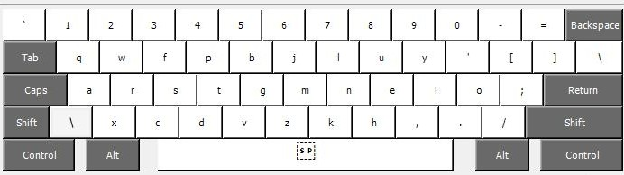

# colemak-win

Add Colemak-DH to the available keyboard layouts under Windows. The layout is installed
at the OS-level and should work in all applications and even before signing in. No 3rd
party apps are required to use the layout.

## Layout

The precompiled binaries install Colemak-DH for standard ANSI keyboards using a EN-US
language profile. Other language profiles and ISO variants can be installed with minor
modifications of the source file (see the "building from source" section below).

## Installation

Download the binaries folder, run `setup.exe`. This will add "Colemak DH" to
the list of available keyboards (requires a reboot on Windows 11). It can be
selected from the language bar (`Ctrl + Shift`) or set as system default in the
language settings.

## Building from source

Download the source file and load it to the Microsoft Keyboard Layout Creator (MSKLC) to
build the binaries. 

*Note:* While some customization can be done in MSKLC itself, it is recommended to
directly edit the source file instead when making changes. Editing keys in MSKLC will
only remap their output but won't change the underlying key event, creating
inconsistencies when using modifiers.

## Why not use AHK/kmonad?

Because installing the keyboard layout at the OS-level is more robust. I wanted a
solution that works across applications and also works at the login screen. (I still use
AHK and kmonad to implement additional goodies on top of this configuration such as
[home row mods](https://precondition.github.io/home-row-mods), dual-function
`space`/`shift` key, `z` on left shift, `backspace` on right alt, `esc`/`ctrl` on
capslock, and others.)
